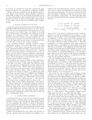

elevate-apj
===========

##*Working to elevate the readability and design of astronomy journal articles.*

#Updates from .astronomy6!
We had a great unconference discussion about the future design and contents of journal articles the first day of #dotastro in Chicago. There was standing room only at the session; check out the Twitter hashtag #hackj. There was also an awesome talk about Authorea in the morning of the first day.

Some article-related hacks: Stuart Lynn made a great [demo](http://openjournals.github.io/polymer_paper/) of what an html5 based paper might look like. Lots of hacks started by Jonathan Sick and Adam Becker on [rich citations](https://github.com/jonathansick/starlit) and [article reccomendations](https://github.com/freelanceastro/astrorec).

For my part I spent hacking time on reformatting some journal articles in to a format that is easier to read on my iPad! This was the **minimum-effort** path to making an article more readable.

[**Here's a screenshot!**](newton2014.jpg)

I generated this from Elizabth Newton's latest paper source on [the arXiv](http://arxiv.org/abs/1412.2758) by changing the first two lines in the .tex file to:

    \documentclass[onecolumn]{elevate-apj}
    \usepackage[paperheight=200in,paperwidth=7in,margin=1.5in]{geometry}

This doccument class `elevate-apj` is just `emulate-apj` with about 5 tiny tweaks. I think it looks **awesome** compared with the normal PDF (or HTML!) layout.

If you want to see a PDF file of my [most recent](http://arxiv.org/abs/1411.3723) paper with this layout more carefuly applied, [look here](flares.pdf). I think the figure placement is great. Tables are deluxe-bad.

## Some challenges
- The `paperheight=` call allows arbitrarily long pages in the resulting PDF. In this way the entie article was contained on one long page. However, I had to set this length manually, and I couldn't find a programatic way to find the length.

- There's a more subtle problem I mused about: How do you "zoom out" to get the 10,000ft overview of the article? This is a general problem with digital reading I think.

- Making this work on arXiv article sources was hard! Only a handful of articles worked out of the box. This is because people put *tons* of customization in to their .tex files to make them work with arXiv.

- Some image viewers automatically scale to the document *height*... which makes for a funny UX at first.

# The problem...

The design for most journal articles in astronomy is a two-column, highly condensed layout. This format makes efficient use of paper, which in turn reduces printing costs. The narrow columns are also easy to read/parse, like that of a newspaper. 

Nearly all journals are changing to an online-only form of publication. This raises two important issues:

1. The web versions of these articles are difficult to read, and so most people avoid them and use the PDF versions instead.
2. The PDF versions of the articles look great on paper, but are difficult to read on a computer screen due to their layout.

In effect journal articles are *not* becoming online-only, they're just outsourcing the printing job to their readers. **Paper is still the best medium to read astronomy journal articles today due to the article layout.**

### We can improve this!

By updating the layout of journal articles we hope to:

- increase use of web/PDF article versions on computers and tablet devices
- improve comprehension and scientific usefulness of articles themselves
- reduce use of paper, trees, ink, printer/photocopier maintenance...

To accomplish this we must:

- consider the screen size and shape of the devices people use.
- consider the human exerience with the article, top-to-bottom flow, avoiding unnecessary scrolling, etc.
- learn from the single-column layout/design of sites like medium.com, and just about every news website.
- make the PDF and web versions of articles as similar as possible.
- make figures/images, as well as tables, seamlessly integrated within the article.

### .astronomy6 Goals/Needs
- discuss and create a new design for journal articles
- hack together a really sloppy implementation of this design in LaTeX
- take the sources files for an article formatted with [emulateapj](http://hea-www.harvard.edu/~alexey/emulateapj/) (probably from the arXiv) and apply this new design
- Try to generate the article for the web as well using the new [**WebTeX engine!**](https://github.com/pkgw/webtex)

I can sketch the design, but would love more people to discuss them with. Perhaps each person took a screenshot of an article or website they thought was a format inspiration? Design on a white board if possible

I can do some hacking in LaTeX, but other expertise/thoughts would be incredibly valuable. Should we start from the article class, or emulateapj package? This LaTeX design doesn't have to be robust, but the primary goal is to create a demo PDF that is more pleasing to read on a computer/tablet.

To do the web version I need people who have skills. Should we try to use Markdown and MathJax? Generate a Jekyll/CSS/somethingelse template? Brute force?

### Resources/Links/Thoughts

- [http://aas.org/media/press-releases/american-astronomical-society-journals-going-electronic-only]()
- [http://www.paulolyslager.com/optimal-text-layout-line-length/]()
- [http://www.dyslexiefont.com]()
- [https://www.authorea.com]()
- [http://www.paulolyslager.com/optimal-text-layout-line-length/]()
- [http://www.dyslexiefont.com]()
- [https://www.authorea.com]()
- [http://www.nngroup.com/articles/avoid-pdf-for-on-screen-reading/]()
- [https://medium.com/the-physics-arxiv-blo]()
